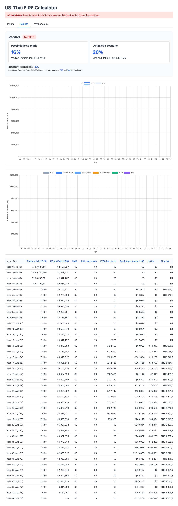

# Task 1: Fix Portfolio Rendering QA

## Verdict: APPROVE

The year-by-year table correctly shows two separate portfolio columns: "Thai portfolio (THB)" and "US portfolio (USD)".

- The headers are exactly as expected.
- The THB and USD portfolio values are different and correctly separated.
- The table is readable and well-formatted.

